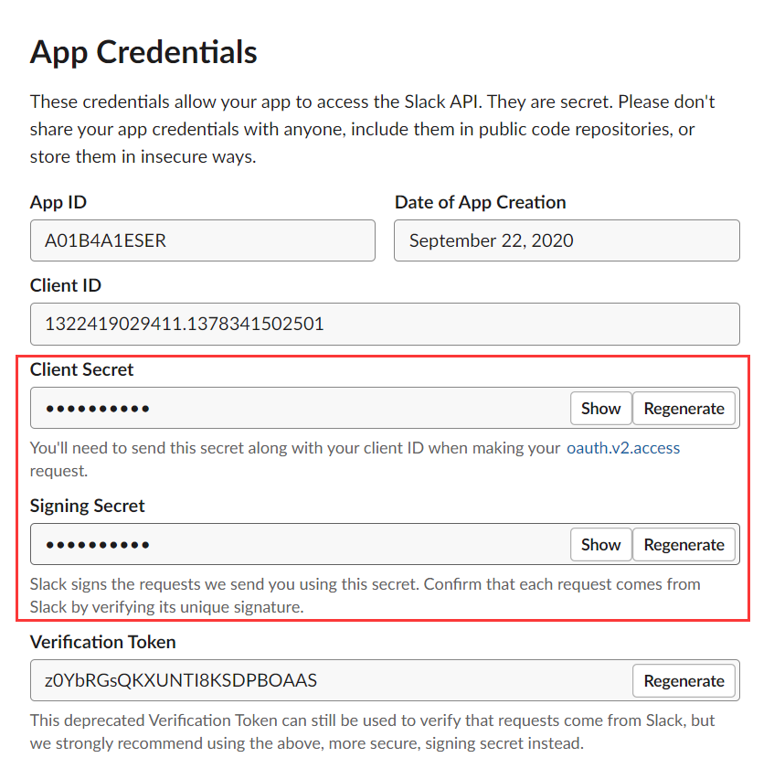
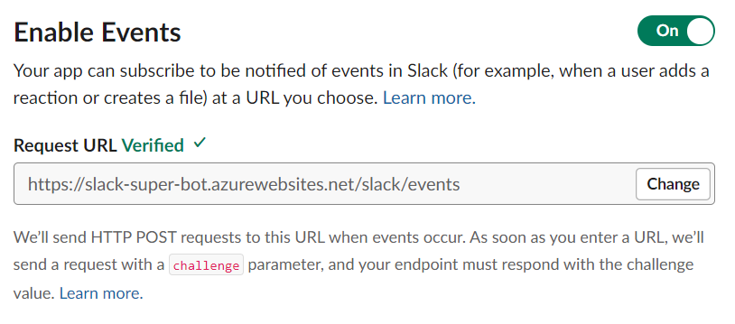
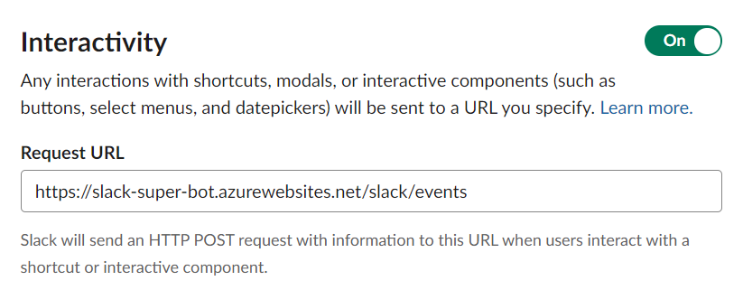
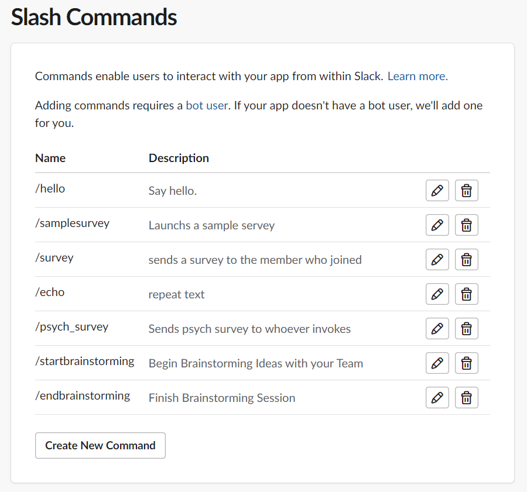
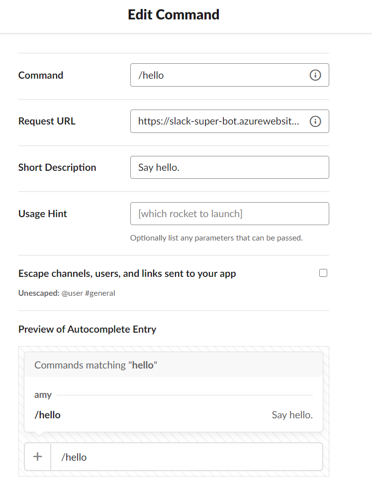

# 483-Team-Support-Slackbots

## File description

app.py: The main program contains all the logic. \
questions_payloads.py: The file include all survey question payloads. \
requirements.txt: Contains every python package being used in the program. Will be installed automatically by pip in each build. \
README.md: This File!

## Slack bot setup

1. Go to the slack API page to create an new app.
2. Add the secrets as environment variables on Azure(described below).

3. Enable events. Fill the request URL to <https://your-domain-name.azurewebsites.net/slack/events>. The green "Verified" should come up after everyting is working correctly.

4. Enable interactivity. Fill the request URL same as above.

5. Create slach commands. Fill the request URL same as above and click "Save".

6. Install app to the workspace under "Install App" tab. Then the bot is good to go.
Reference: <https://github.com/slackapi/python-slack-events-api/blob/main/example/README.rst>

## Azure service setup

1. Log in to Azure with PSU account.
2. Create a new subcription.
3. Create the services in the subcription. The services we are current using is included in the image below.

    3.1. After set the service and tokens, the database and the container should be created automatically by the code. \
    Reference: <https://docs.microsoft.com/en-us/azure/cosmos-db/create-sql-api-python>
    3.2. For "Cognitive Services", we are using "Text Analytics" API to provide sentiment analysis. \
    Reference: <https://docs.microsoft.com/en-us/azure/cognitive-services/text-analytics/quickstarts/python>
4. Get the service tokens from services. Then. go to "App Service>Configuration", enter all related tokens as environment variables.

5. Under "App Service>Deployment Center", choose "GitHub Action". Then the app will build and redeploy on push. The action will require advanced permission on GitHub repo.
Note: "App Service>Log stream" is super helpful for debugging. \

## Some useful links

Remember, always check slack and Azure documents! \
bolt framework: <https://slack.dev/bolt-python/>
slack API: <https://api.slack.com/>
Azure doc home: <https://docs.microsoft.com/en-us/azure/>